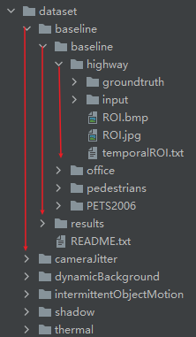
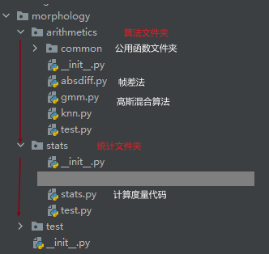
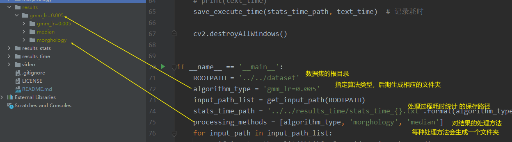
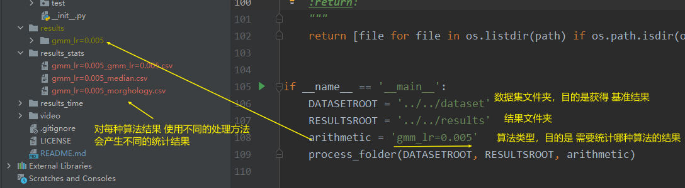

# morphology
# 项目目录说明

# 程序文件夹

# 每种算法对应的结果文件夹

# 结果统计代码对应的统计文件夹

## 统计文件的head
```python
"""
{'Recall': recall,
 'Precision': precision,
 'FMeasure': fmeasure,
 'Specificity': specficity,
 'FPR': fpr,
 'FNR': fnr,
 'PWC': pbc}
'resolution'  # 分辨率
'total_frames'  # 总帧数
'valid_frame'   # 有效帧数
'start_frame'   # 起始帧号
'end_frame'   # 结束帧号
"""

```